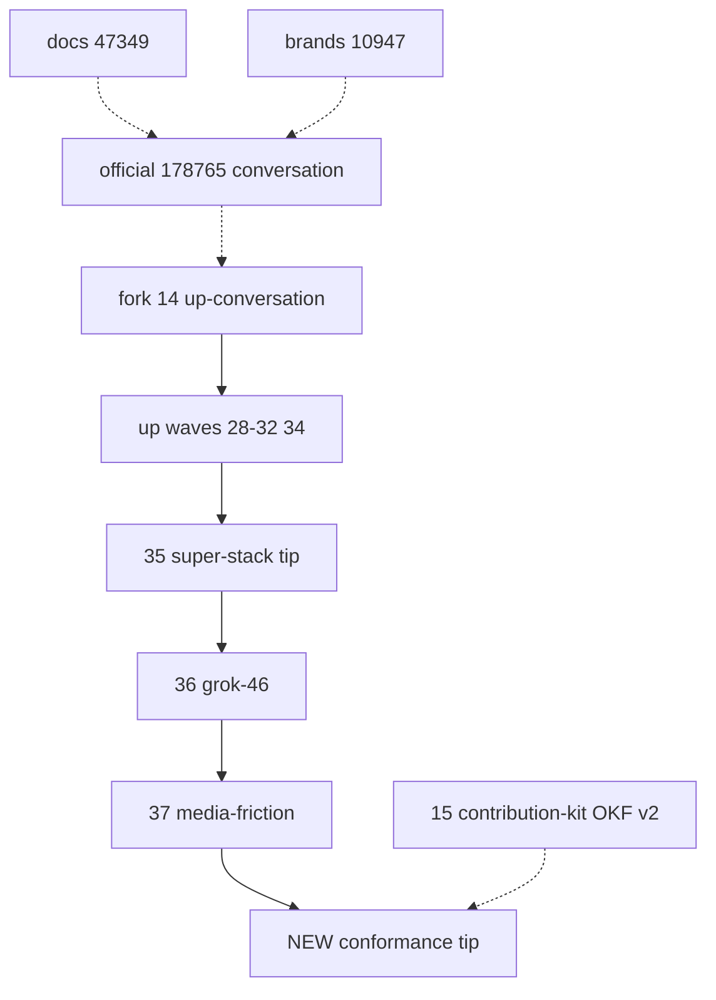

# Super-stack conformance and cruftless pass

The plan UI looked blank because the first draft used a markdown table (the plan renderer cannot show those) and the file lived only in the agent artifacts folder. This copy is the same plan, with lists instead of tables.

## Constraint that shapes everything

Official Home Assistant review rules say: keep Core PRs small, one change, no extra files, no dependent unmerged PRs, and no more than five open Core PRs. The local super stack is a **staging tree**, not something to dump onto `home-assistant/core`.

The downloaded guidelines and wake checklist **must not land on Core-bound slices** (`#14`, `#28`–`#32`, `#34`–`#37`, official `#178765`). They go only on the existing fork-only kit: [jeffglousher/core#15](https://github.com/jeffglousher/core/pull/15) / `cursor/spacexai-contribution-kit-2f69` under `.github/spacexai-contribution/`.

Code/test hygiene that the whole tip needs goes on a **new tip** `cursor/spacexai-conformance-2f69` based on current media-friction (`#37` / `e1ae2caa`). Do not rebase, amend, or squash already-pushed commits. Do not merge `#37` into `#36`. Do not touch official `#178765`.

## Phase 1 — OKF v2 knowledge pack (kit only)

Create `.github/spacexai-contribution/okf/v2/` on `cursor/spacexai-contribution-kit-2f69`:

- `manifest.yaml` — `okf_version: 2`, `retrieved_at: 2026-08-15`, retrieval timezone, retriever, purpose
- `sources.yaml` — one entry per official page: canonical URL, title, retrieved_at, content hash
- `snapshots/` — raw markdown snapshots of each page (no rewriting)
- `rules.yaml` — extracted MUST/SHOULD rules with `id`, `source`, `severity`, `stack_implication`
- `WAKE.md` — the heavy check every next agent must run before writing code

Official pages to snapshot (canonical developer docs, retrieved 2026-08-15):

- https://developers.home-assistant.io/docs/development_checklist
- https://developers.home-assistant.io/docs/creating_component_code_review
- https://developers.home-assistant.io/docs/development_submitting
- https://developers.home-assistant.io/docs/review-process
- https://developers.home-assistant.io/docs/development_guidelines
- https://developers.home-assistant.io/docs/development_testing
- https://developers.home-assistant.io/docs/ai_policy
- https://developers.home-assistant.io/docs/core/integration-quality-scale/rules
- https://developers.home-assistant.io/docs/creating_integration_manifest
- Local copies already in-tree: `AI_POLICY.md`, `.github/PULL_REQUEST_TEMPLATE.md`, `AGENTS.md`

Add a Cursor rule that points at `WAKE.md` so every wake starts with the conformance check.

## Phase 2 — Heavy conformance review (read, then score)

Score the **entire current set** against OKF v2. Current live map (stale vs kit `STACK.md`):

- Official Core: [home-assistant/core#178765](https://github.com/home-assistant/core/pull/178765) — conversation-only. Do not touch.
- Fork wave 1: [jeffglousher/core#14](https://github.com/jeffglousher/core/pull/14) — `up-conversation`
- Mid waves: [#17](https://github.com/jeffglousher/core/pull/17)–[#24](https://github.com/jeffglousher/core/pull/24), [#28](https://github.com/jeffglousher/core/pull/28)–[#32](https://github.com/jeffglousher/core/pull/32), [#34](https://github.com/jeffglousher/core/pull/34) — capabilities through platinum
- Combined tip: [#35](https://github.com/jeffglousher/core/pull/35) — stacked 1–6 view only
- Grok 4.6: [#36](https://github.com/jeffglousher/core/pull/36) — fallbacks
- Media friction: [#37](https://github.com/jeffglousher/core/pull/37) — persist/publish/stream; required CI green
- Kit: [#15](https://github.com/jeffglousher/core/pull/15) — fork meta only
- Docs / brands: [io#47349](https://github.com/home-assistant/home-assistant.io/pull/47349), [brands#10947](https://github.com/home-assistant/brands/pull/10947) — published URLs still 404

Known HA-rule collisions to score honestly (do not paper over):

- **Dependent PRs / more than five open PRs** — local stack is allowed; official Core may only receive wave 1 after brands/docs/OAuth gates. Later waves wait for merge.
- **PyPI library MUST** — official component review wants API code in a third-party library. Current tree uses pinned `openai==2.45.0` plus in-tree `client.py`, same pattern as `openai_conversation`. This pass **does not** extract a new PyPI package. Document the peer exception in OKF and keep the client thin where cheap.
- **Platinum honesty** — `manifest.json` claims platinum while official docs/brands 404. Keep `done` plus comments (hassfest bronze requires it if claimed). Do not flip to `todo` on a Core-bound slice.
- **Perfect-PR size** — kit already says wave 1 is ~5.7k and should trend toward 2–2.5k by trimming exotic stream tests, not production modules.
- **Commit message style** — HA wants imperative, no trailing period. Apply to **new** commits only.
- **AI policy** — Jeff must be able to explain every change. No autonomous official PRs or unreviewed comments.

## Phase 3 — Review automated tests

Inventory is 12 test modules under `tests/components/spacexai/`. `#37` CI already proved `Run tests Python 3.14.5 (spacexai)` plus pylint/mypy/hassfest/prek.

This pass reviews tests against official testing docs and `AGENTS.md`:

- Prefer public HA surfaces (`hass.services`, `hass.states`, config entries) over internals
- Typed parameters, `@pytest.mark.usefixtures` when unused, no branching, parametrize duplicates
- No leftover files in `tests/testing_config` (already fixed on `#37` via autouse cleanup)
- Do not `--snapshot-update` unless intended
- Windows cannot run HA pytest; use overlay host or fork CI

Likely cruft to confirm during the pass:

- Tests that import integration internals (`_format_tool`, `_stream_failure`, `KEY_ASSIST_PIPELINE`)
- Conversation image-model send path missing entitlement coverage
- `#36` still red on inherited lint/hassfest — tip already carries those fixes; do not rewrite `#36`

## Phase 4 — Cruftless compliance implementation (new tip)

Branch: `cursor/spacexai-conformance-2f69` from `cursor/spacexai-media-friction-2f69`.

In-scope only where the review finds a real HA-rule or cruft hit:

- Remove dead raise-and-catch / unused imports / leftover comments that restate code
- Align new commit messages with submitting rules
- Close test isolation gaps and public-API test drift
- Conversation image-model entitlement at send time **if** the review confirms it is a real contract hole
- Keep OAuth `conversations:read/write` unless a reauth plan is included

Out of scope:

- Extracting a PyPI `spacexai` library
- Rewriting lower one-commit slices
- Opening official Core PRs
- Marking `#37` ready or merging any wave
- Controlling household devices

## Phase 5 — Kit refresh so the next wake cannot use a stale map

On `#15` only, update `STACK.md`, `TRACKING.md`, and `HUMAN_CHECKLIST.md` to the live PR map (official `#178765`, `#36`, `#37`, new conformance tip, 404 gates). `WAKE.md` becomes the first file the next agent reads.

## Success bar

- OKF v2 exists with sources + retrieval date + hashes
- Every later wake has a written conformance ritual
- New tip PR is draft, required CI green, no kit files in the Core diff
- Kit STACK matches reality
- Official Core still only gets wave 1 when Jeff flips the switch after brands/docs/OAuth
